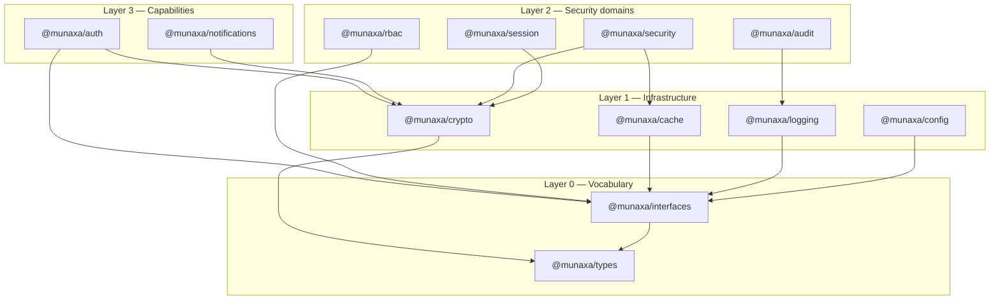
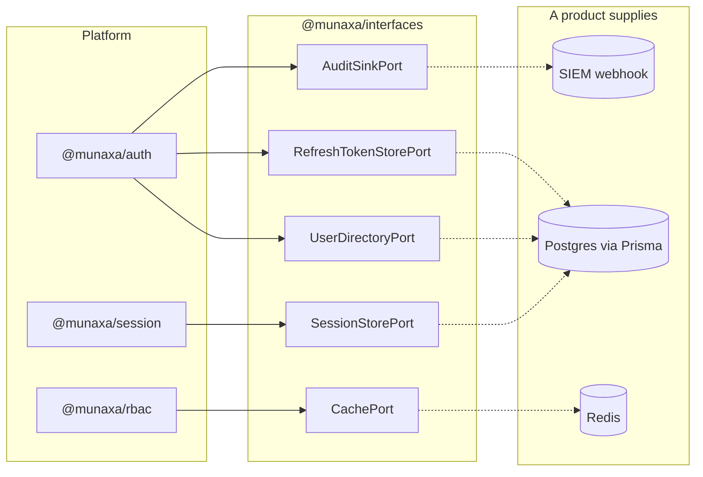
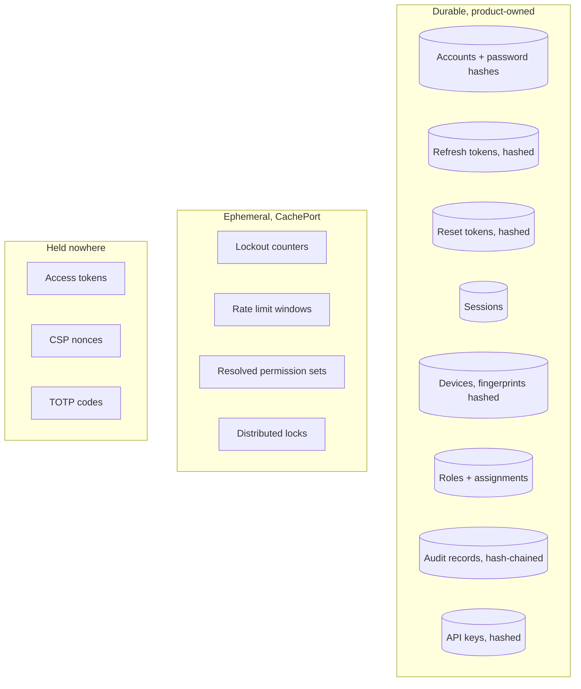
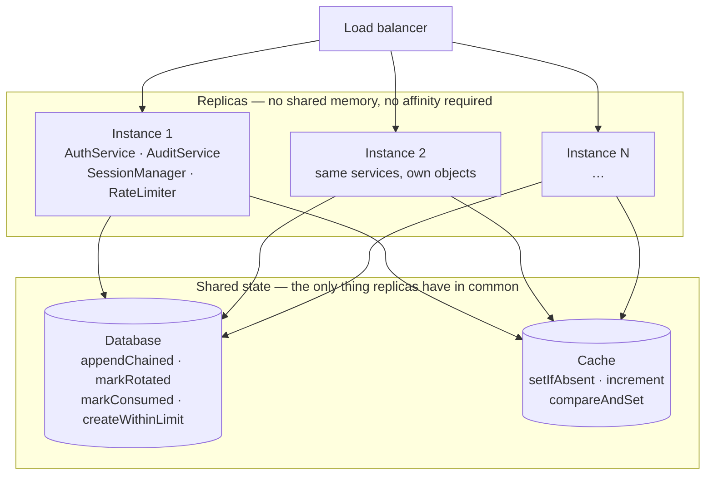
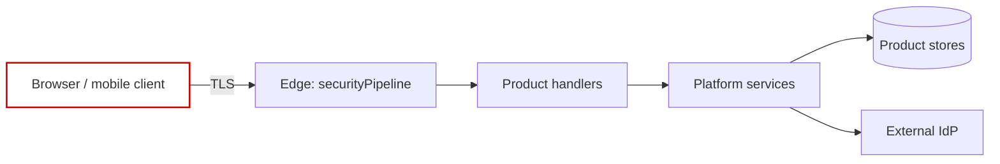

# Architecture

## The shape of the thing

The platform is four layers. Each depends only on layers below it, which is what keeps the graph
acyclic and lets a product adopt one package without adopting all twelve.

**Layer 0** is vocabulary. `types` has no behaviour worth naming; `interfaces` has none at all
beyond a token table and a twenty-line registry. Depending on either can never pull infrastructure
into a build.

**Layer 1** is infrastructure with a single responsibility each, and no knowledge of authentication
or authorization.

**Layer 2** is the security domains. Each is independently useful: a product can adopt `@munaxa/rbac`
alone, or `@munaxa/audit` alone.

**Layer 3** composes — but through ports rather than imports. `auth` returns a *decision*; the
product's composition root feeds that to `SessionManager`, `TokenService` and `AuditService`. The
result is that `@munaxa/auth` imports only `types`, `interfaces` and `crypto`, and a product can
adopt authentication without adopting the platform's session or audit implementations. The
[P2 audit](./production-readiness-audit.md) corrected this diagram, which previously drew
dependencies the code does not have.

## Ports, and why everything is one

Every capability the platform needs from the outside world is an interface in `@munaxa/interfaces`
with no implementation:

Three consequences follow, and all three are the reason for the design:

1. **No vendor reaches a product transitively.** A product deploying on Cloudflare Workers with D1
   and KV implements the same ports as one on Kubernetes with Postgres and Redis. `@munaxa/auth` is
   identical in both.
2. **The platform's own tests run against the memory implementations**, which are shipped. They are
   the executable specification of what a product's adapter must do — including the tenant assertion
   on every read, which is the part a hand-written repository usually forgets.
3. **A missing dependency fails at composition, not at request time.** `ServiceRegistry.assertRegistered`
   names every unwired port at boot.

## The one thing the platform does not own

Products own their data. `CredentialRecord` is a *projection* of a product's user table — a user id,
a tenant, an identifier, a password hash, a status, a token version — and nothing else. No profile,
no name, no product fields. The platform never migrates a schema, never owns a table and never
requires one to be shaped a particular way.

## Where state lives

The middle column is the one worth understanding. Everything in it is *recoverable*: losing the
cache costs a burst of extra database reads and resets some counters. Nothing in it is the only copy
of anything, which is why rate limiting can fail open and permission caching can be dropped wholesale.

There is a fourth column that used to exist and no longer does: **held in a service field**. Platform
1.0 kept the audit chain head, the set of used TOTP steps and the deduplication window in private
maps on service objects. Each was correct with one process and silently wrong with two, and none of
them raised an error on the path that was wrong. 2.0 has no such state: anything that must happen at
most once is decided by the store, in one conditional operation, and exactly one caller is told yes.
See [distributed guarantees](./distributed-guarantees.md).

## Running more than one replica

Nothing in the fleet box talks to anything else in the fleet box. There is no gossip, no leader,
no sticky sessions and no coordination protocol — a replica is stateless, and every decision that
needs agreement is pushed down to one conditional operation in the shared box. That is what makes
the platform deployable unchanged on Kubernetes, Docker Swarm, Azure App Service, AWS ECS, Cloud
Run, Cloudflare Workers, Render and Fly.io: none of them are asked for anything beyond "several
processes, one database, one cache".

The corollary is that the shared box has to be able to do those operations. Where a backing cannot —
Cloudflare KV has no compare-and-set — the platform degrades explicitly and reports the mode it is
in, rather than behaving as though it had the guarantee. See the degradation table in
[distributed guarantees](./distributed-guarantees.md#degradation-declared).

## Trust boundaries

- **Client → edge.** Everything is hostile. Normalization, rate limiting, origin and CSRF checks
  happen here, in that order, before any handler runs.
- **Edge → handlers.** A `SecurityContext` exists from here on: tenant, principal, correlation id.
  Handlers never re-derive it from headers.
- **Handlers → platform.** Context is passed explicitly as the first argument. The platform never
  reads it from ambient state, because a background job that inherits the last request's principal
  is a hard bug to find and a serious one to have.
- **Platform → external IdP.** The identity provider is trusted for the identity it asserts and
  nothing else. Its groups are input to a product's role mapping, never permissions directly.

## Decisions worth knowing about

**Sessions are server-side state, not a claim in a token.** A JWT cannot be un-issued. "Sign out
everywhere", "revoke this device" and "we locked the account" are only real if something server-side
is consulted, so access tokens are short-lived and carry `sid`, and the session decides.

**Refresh tokens are opaque, not JWTs.** A long-lived self-contained credential nobody can withdraw
is the failure mode this avoids. Opaque plus hashed-at-rest plus single-use plus family revocation
turns a stolen refresh token into a detectable, self-limiting event.

**Deny-overrides in authorization.** Any matching deny wins regardless of order or specificity.
Anything else eventually produces a rule that grants what another rule forbids.

**Heuristics report; they do not block.** The risk engine and the threat detectors emit events and
raise a score. Nothing in the platform silently blocks a login on a pattern match, because every
signal has a false-positive mode that looks exactly like a person travelling or changing phone.

**Rate limiting fails open.** A rate limiter that fails closed converts a cache outage into a total
outage. The decision carries `degraded: true` and the callback fires, so failing open is visible
rather than silent.

**One event vocabulary.** `SECURITY_EVENTS` is closed. Seven products emitting `login_ok` and
`user.signed_in` and `auth.login.success` cannot share a dashboard, an alert rule or a SIEM pipeline.
