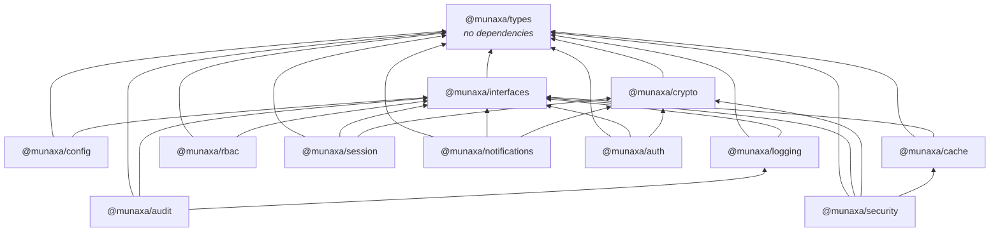
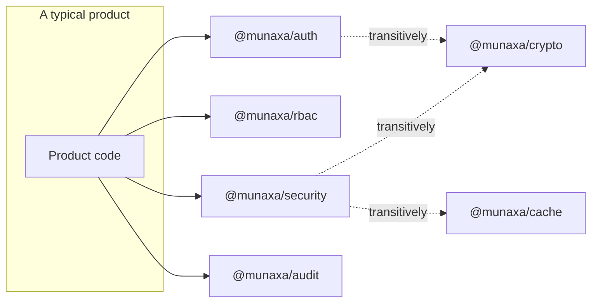

# Package dependencies

## The graph



## Rules

**The graph is acyclic and stays that way.** Two packages that need each other's behaviour do not
import each other — one of them takes a callback or a port. `@munaxa/rbac` reports authorization
decisions through an `onDecision` hook rather than depending on `@munaxa/audit`, and
`@munaxa/session` emits events through `onEvent` rather than importing an audit service. The product
wires the two together at its composition root, which is also where it decides what "wired together"
means for its deployment.

**Nothing depends on an application.** No package under `packages/platform/*` imports from a product,
and none ever will. The check is mechanical: a product-specific concept in a platform package is a
review failure.

**Nothing names a vendor.** `@munaxa/interfaces` has a test that greps its own source for `Redis`,
`Prisma`, `Postgres` and friends in a type position. The adapters that *do* name a vendor —
`RedisCache` — depend on a locally declared structural interface (`RedisLike`), never on the client
package.

**A package may add an optional dependency; it may not add a required one lightly.** Adding
`@munaxa/cache` to `@munaxa/rbac` would mean every product taking RBAC now takes a cache. The
resolver takes an optional `CachePort` instead, and works without one.

## What a product depends on

Most products need three or four packages, not twelve.



Adding `@munaxa/auth` to a `package.json` pulls in `crypto`, `interfaces` and `types` — three
packages, zero third-party runtime dependencies, and nothing that touches the network or the
filesystem until a product wires a port that does. A product that also wants sessions, roles and an
audit trail depends on those packages explicitly, which is the honest shape: `auth` composes with
them through ports, it does not contain them.

## Third-party runtime dependencies

There are none. Every package's `dependencies` field contains `@munaxa/*` entries and nothing else;
the only imports outside the workspace are Node built-ins (`node:crypto`, `node:util`,
`node:async_hooks`).

That is a deliberate constraint rather than an accident, and it is what makes the platform viable
across the ecosystem's deployment targets: a package with a native dependency does not run on an edge
runtime, and a package with an email SDK forces that vendor on a product that sends no email.

## Build and test topology

Turborepo derives task order from the same graph:

```
pnpm turbo run build typecheck test lint --filter='./packages/platform/*'
```

`build` depends on `^build`, so `types` compiles before `interfaces`, which compiles before
`crypto`, and so on. Tests run against each package's `src/`, not its `dist/`, so a test failure
points at a line of source rather than at compiled output.

## Adding a package

1. Decide its layer. If it needs something from a higher layer, it is in the wrong layer or the
   dependency belongs behind a port.
2. Scaffold it beside the others — `package.json`, `tsconfig.json`, `tsconfig.build.json`,
   `eslint.config.mjs`, `vitest.config.ts` — matching an existing package exactly.
3. Add the five test suites. A package without a `compat.test.ts` has no compatibility surface
   documented, which means the first breaking change will be accidental.
4. Add it to the table in [README.md](./README.md) and to the graph above.
