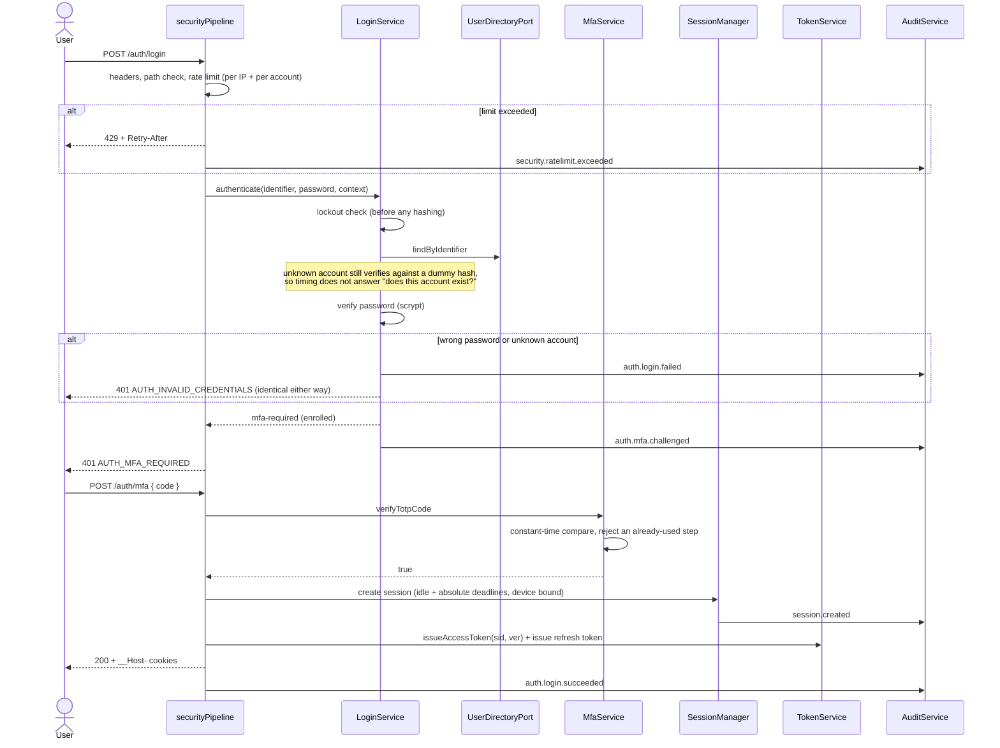
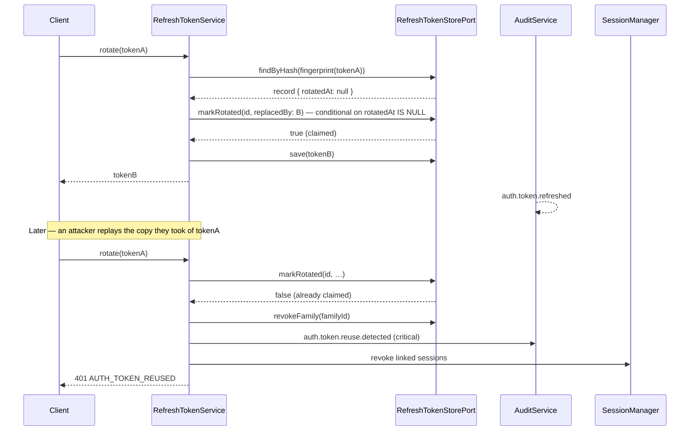
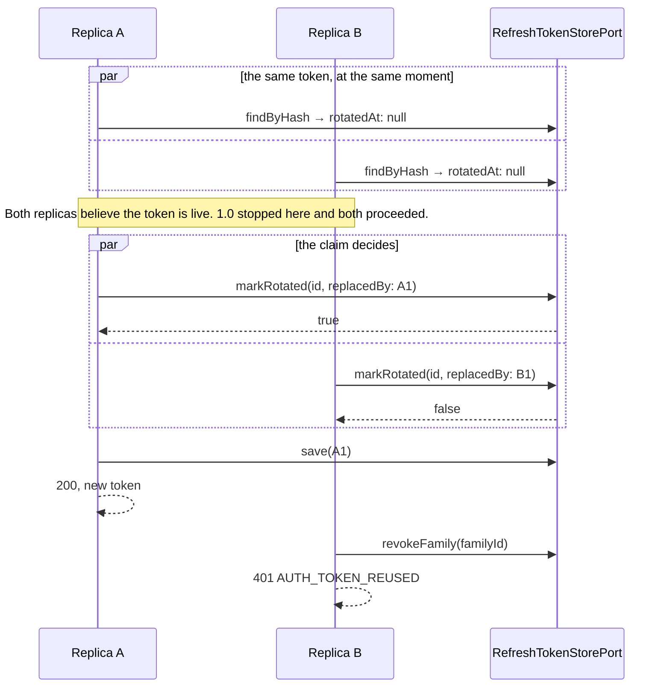
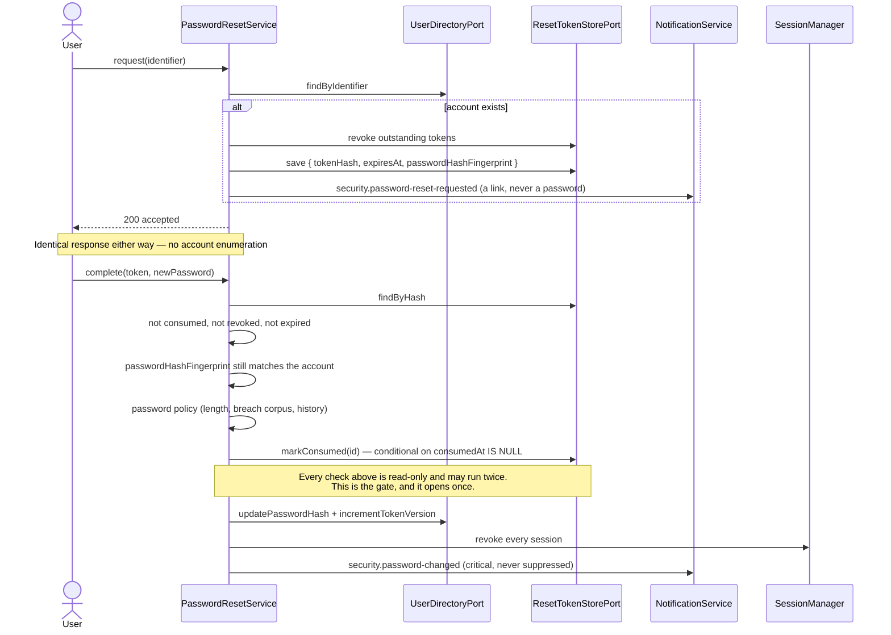
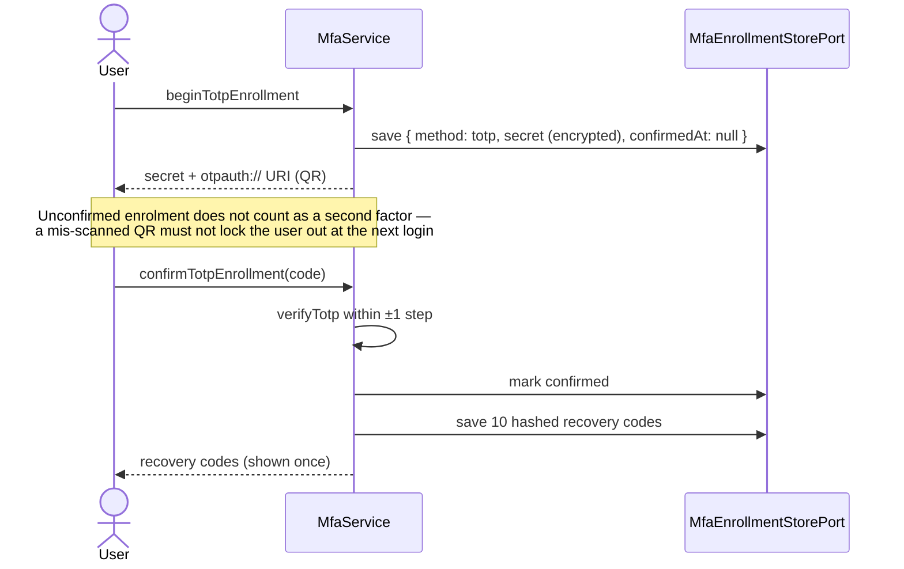
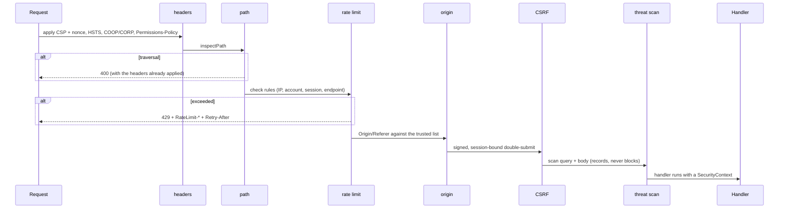

# Sequences

The flows the platform implements, drawn as they actually run.

## Password login with a second factor



The ordering that matters: the lockout check precedes the KDF, so a locked account costs an attacker
a cache read rather than 16 MiB and 80 ms; and the account-existence branch happens *after*
verification, so both paths cost the same.

## Refresh rotation, and what a replay does



Both parties lose access, deliberately. There is no way to tell which of the two holders is the
legitimate one, and the legitimate user experiences an unexpected sign-out — which is the signal
they need, and far better than an attacker keeping quiet access indefinitely.

The claim is what makes that true across replicas. The `findByHash` above is a fast path that saves
a write when the replay is not a race; the *decision* is `markRotated`, and the store tells exactly
one caller `true`. A thief presenting the token at the same moment as the legitimate client is
precisely the case where reading `rotatedAt` and then writing it back would have let both through —
which is how Platform 1.0 disabled its own reuse detection under exactly the conditions that
mattered.

## Two replicas, one refresh token



Every other at-most-once operation has this same shape: `markConsumed` for a reset link,
`setIfAbsent` for a TOTP step or a one-time code, `appendChained` for an audit record. Read freely;
decide once, in the store.

## Password reset



`passwordHashFingerprint` is what closes the "request two links, use the older one" replay: any
password change by any route invalidates every outstanding token.

## MFA enrolment



## The request pipeline



Headers first is not cosmetic: a 429 produced by step three still needs `X-Content-Type-Options`,
because a browser renders it.

## Authorization

```mermaid
sequenceDiagram
  participant H as Handler
  participant Az as Authorizer
  participant Rv as PermissionResolver
  participant Ca as CachePort
  participant Pe as PolicyEngine

  H->>Az: require(context, { permission, resource })
  Az->>Rv: resolve(tenantId, userId)
  Rv->>Ca: get(rbac:tenant:user)
  alt miss
    Rv->>Rv: role assignments → hierarchy → normalized grants
    Rv->>Ca: set (short TTL; revocation is explicit, not by expiry)
  end
  Rv-->>Az: permissions
  Az->>Pe: evaluate (deny policies → role grant → allow policies)
  alt denied
    Az->>Az: onDecision → authz.permission.denied
    Az-->>H: throw AUTHZ_PERMISSION_DENIED<br/>(same code and message for every denial reason)
  end
  Az-->>H: allowed
```

## Key rotation

```mermaid
sequenceDiagram
  participant Op as Operator
  participant KR as KeyRing
  participant Job as Re-encryption job

  Op->>KR: rotate(k2)
  Note over KR: k2 signs and encrypts new values; k1 still reads old ones
  Job->>KR: for each record — needsReencryption?
  Job->>KR: reencrypt (decrypt under k1, encrypt under k2)
  Note over Op,Job: Wait out the longest lifetime of anything signed under k1
  Op->>KR: retire(k1)
```

Every ciphertext and signature carries its `kid`, so step three is safe the moment nothing references
the old key — and `KeyRing.retire` refuses to remove the primary, which is the mistake that turns a
rotation into an outage.

## Appending to the audit chain

```mermaid
sequenceDiagram
  participant S as AuditService
  participant R as AuditRepositoryPort
  participant DB as Store

  S->>R: appendChained(tenantId, seal)
  activate R
  R->>DB: read head FOR UPDATE (or read + unique index)
  DB-->>R: { sequence: n, hash: h }
  R->>R: seal({ sequence: n, hash: h }) → record n+1
  R->>DB: insert record n+1
  DB-->>R: committed
  deactivate R
  R-->>S: record

  Note over S,R: An optimistic adapter may instead raise ChainConflictError<br/>on the unique-index violation; AuditService retries up to maxChainAttempts.

  S->>S: fan out to sinks (SIEM, NDJSON, collector)
  Note over S: A sink failure is counted, never fatal.<br/>An append failure fails the request — a request<br/>that proceeds unaudited is worse than one that fails.
```

The sealing function is supplied by the caller and executed *by the store*, inside whatever
critical section the adapter uses. That inversion is the whole fix: a replica never proposes a
sequence number, so two replicas cannot propose the same one.
